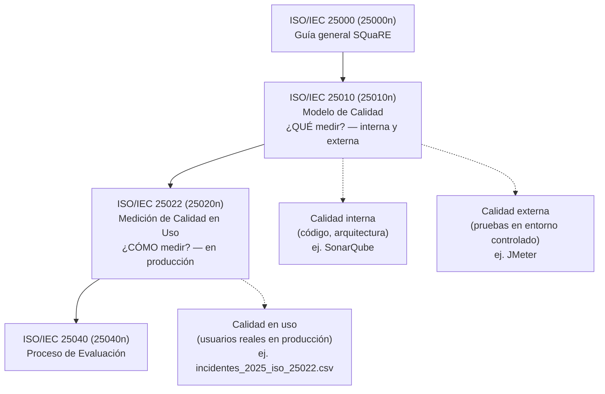

# Comprensión del Modelo SQuaRE aplicado a MediSalud (Escenario 3)

## Paso 1: Investigación dirigida — Calidad interna vs. externa vs. en uso

**Calidad interna.** Es la calidad medida sobre el propio artefacto de código,
sin ejecutarlo frente a usuarios: complejidad ciclomática, duplicación,
acoplamiento, cobertura de pruebas, deuda técnica (ISO/IEC 25010, vista
estática). En MediSalud equivaldría a correr SonarQube sobre el repositorio de
los microservicios (HCE, Facturación, Farmacia) sin necesidad de desplegarlos.

**Calidad externa.** Es el comportamiento del sistema ya ejecutándose, pero
observado en un entorno controlado (pruebas, QA, staging), no en manos de
usuarios reales (ISO/IEC 25010, vista dinámica). En MediSalud equivaldría a
pruebas de carga con JMeter simulando 500 usuarios concurrentes en el Portal
de Citas, o pruebas funcionales automatizadas antes de un despliegue.

**Calidad en uso.** Es la experiencia real de usuarios reales realizando
tareas reales en producción (ISO/IEC 25022). Es el único nivel que responde
directamente a la pregunta de negocio ("¿el médico logra registrar la nota a
tiempo, en su hospital, en su horario pico?") y es el nivel que este taller
mide de forma exclusiva a partir de los `3000` incidentes reales de
`incidentes_2025_iso_25022.csv`.

La diferencia clave: un sistema puede aprobar los tres primeros niveles
(código limpio, pruebas de carga exitosas) y aun así fallar en el cuarto,
porque la calidad en uso depende de condiciones que solo aparecen en
producción: red real de cada sede, dispositivos reales del personal, volumen
real de pacientes en horas pico, y hábitos reales de uso.

## Mapa conceptual: ubicación de ISO/IEC 25022 en la familia SQuaRE

*(Diagrama en formato Mermaid: se renderiza automáticamente al visualizar este
archivo en GitHub. Se usó texto versionable en lugar de una imagen de
Draw.io/Miro para mantenerlo dentro del repositorio y facilitar su
actualización junto con el resto del análisis.)*

## Paso 2: Tabla 3.2 — Los tres niveles de calidad aplicados a MediSalud HIS

| Nivel | Ejemplo en MediSalud HIS | Evidencia disponible hoy |
|---|---|---|
| Calidad interna | Complejidad ciclomática y duplicación de código del microservicio de HCE, medidas con SonarQube sobre el repositorio `medisalud-his` (Spring Boot / FastAPI). | Ninguna: el código fuente de MediSalud HIS no forma parte de este taller; se menciona solo como referencia conceptual del nivel. |
| Calidad externa | Pruebas de carga con JMeter simulando 500 usuarios concurrentes abriendo la ficha clínica en el módulo HCE, antes de liberar una nueva versión a producción. | Ninguna: no hay resultados de staging/QA en el dataset; sería el siguiente nivel a instrumentar tras este taller. |
| **Calidad en uso** | Tiempo real que tarda un médico en guardar una nota de evolución clínica durante consulta externa (dato de producción). | **Sí, medible hoy:** 63 incidentes reales de "Nota de evolución tarda Ns en guardarse", con un promedio de **22.1s** (rango 9–35s), muy por encima del umbral RNF-01 (≤8s en el 90% de los casos). El **100%** de estos incidentes ya supera dicho umbral. |

La tabla evidencia la asimetría real del caso: MediSalud tiene cero evidencia
documentada de calidad interna o externa, pero sí cuenta —gracias al trabajo
de los Escenarios 1 y 2— con evidencia cuantificada de calidad en uso, que es
justamente el nivel que este programa de medición se propone formalizar.

## Preguntas de Discusión

**1. ¿Puede un sistema tener excelente calidad interna (código limpio) y mala
calidad en uso? Explique con un ejemplo.**

Sí. El módulo de HCE podría tener bajo acoplamiento, alta cobertura de
pruebas unitarias y cero *code smells* en SonarQube (excelente calidad
interna), y aun así fallar en producción: los datos muestran que el **100%**
de los 63 casos de guardado de nota de evolución superan el umbral de 8
segundos, con hasta 35s en horas pico. El código puede estar "limpio" y, sin
embargo, degradarse bajo la carga real de las 10:00–12:00 en un hospital de
Quito, algo que ninguna métrica de código por sí sola puede detectar.

**2. ¿Por qué SonarQube (calidad interna) no es suficiente para que MediSalud
resuelva su problemática de lentitud percibida por los médicos?**

Porque SonarQube analiza el código en reposo, no el sistema bajo las
condiciones reales que generan la lentitud: concurrencia de cientos de
médicos a la misma hora, latencia de red entre sedes, carga de la base de
datos con años de historiales, o picos de uso en el módulo de HCE (el más
reportado del dataset, con 769 incidentes, de los cuales 111 son de
Eficiencia y 456 de Libertad de Riesgo). Un código con complejidad
ciclomática baja puede seguir ejecutando una consulta a base de datos
ineficiente bajo carga real; SonarQube no ejecuta el sistema en producción,
por lo que es estructuralmente incapaz de capturar ese tipo de degradación.
Solo la Calidad en Uso (ISO/IEC 25022), medida directamente sobre el
comportamiento en producción, expone este tipo de problema.

## Conclusiones Parciales

Este escenario confirma que MediSalud no tiene un problema de "calidad" en
abstracto, sino específicamente un vacío en el nivel de **calidad en uso**:
no existe evidencia de calidad interna ni externa en este taller, pero el
dataset de incidentes ya demuestra que, aun si el código fuera intachable, la
experiencia real del médico (22.1s promedio para guardar una nota, casi 3
veces el umbral aceptable) seguiría siendo mala. Esto justifica que el resto
del taller se enfoque exclusivamente en ISO/IEC 25022, sin descuidar que a
futuro MediSalud debería instrumentar también calidad interna y externa como
capas complementarias, no sustitutas.
